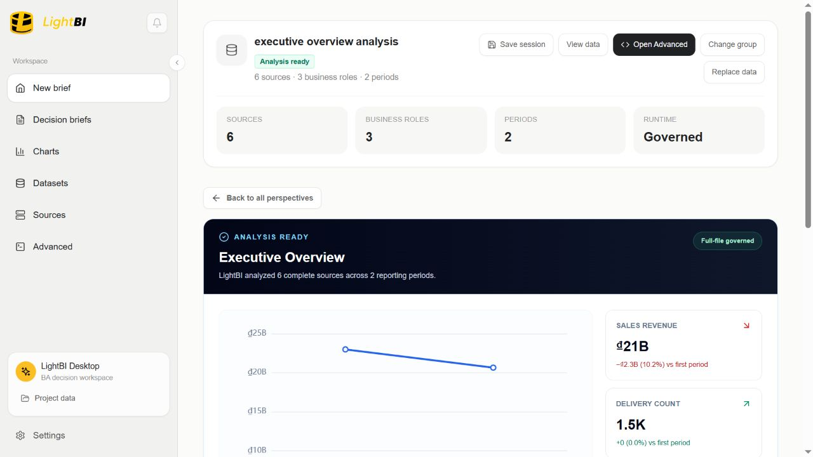
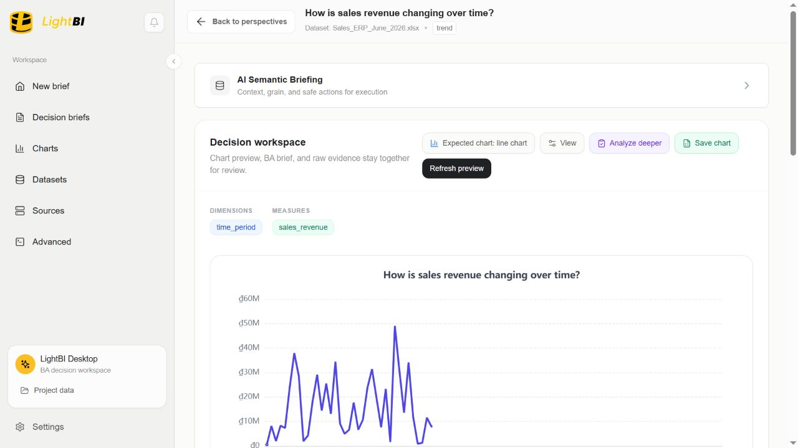
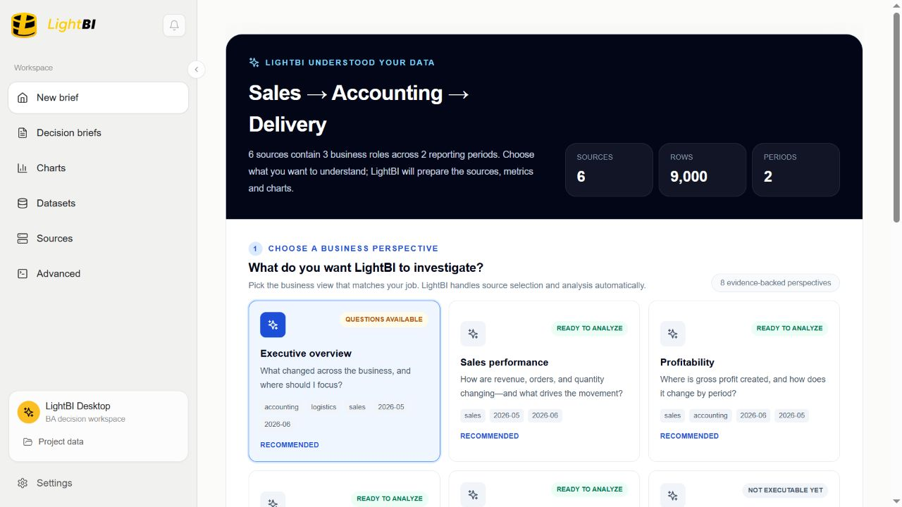
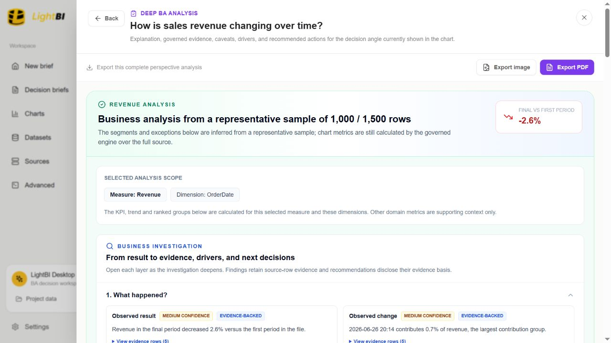
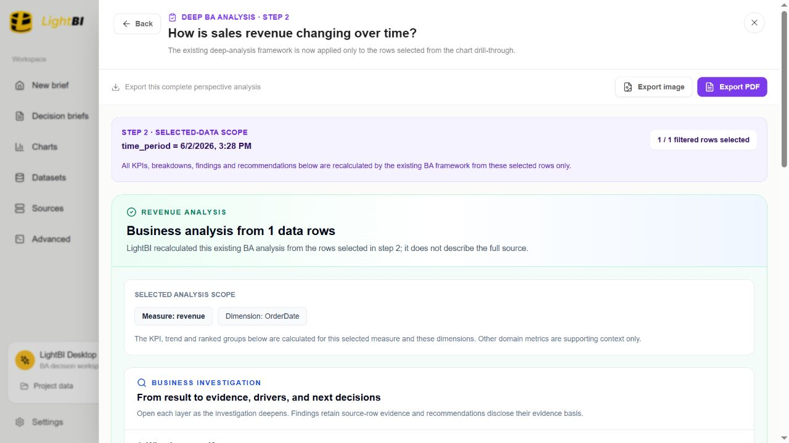
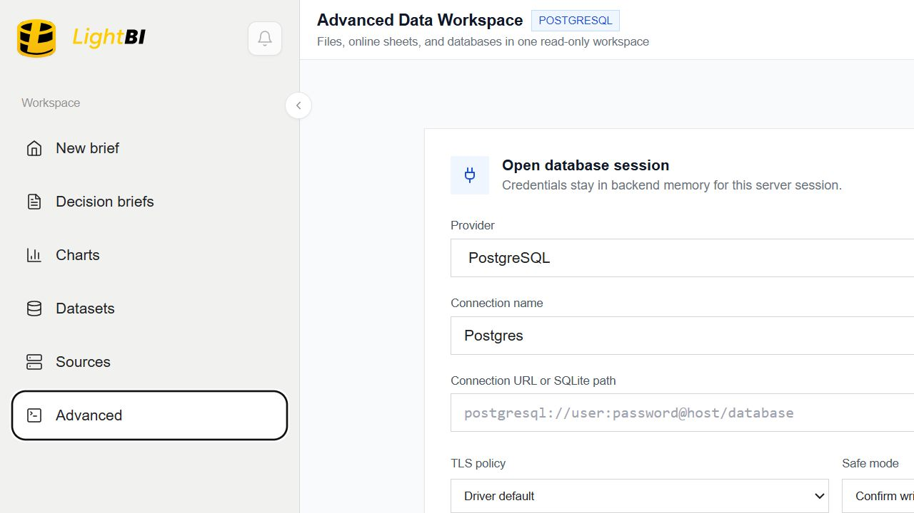
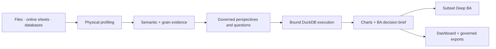

# LightBI

<p align="center">
  <strong>Evidence-governed business analysis for real operational data.</strong>
</p>

<p align="center">
  <a href="https://lightbi.thaiduy.digital/app">Live demo</a> ·
  <a href="https://lightbi.thaiduy.digital/">Download Beta</a> ·
  <a href="README.vi.md">Tiếng Việt</a>
</p>

<p align="center">
  
  
  
  
</p>



LightBI turns spreadsheets, delimited files, online sheets, and databases into a governed business-analysis workflow. It profiles the physical source, resolves business meaning with traceable evidence, proposes safe questions, executes against the bound source, and keeps limitations visible from chart to dashboard.

It is built for the files people actually use: multi-sheet workbooks, inconsistent headers, mixed languages, operational exports, and related ERP reports that must not be joined by guesswork.

## Why LightBI

- **Understand before charting.** Physical profiling, semantic candidates, grain checks, readiness, and provenance run before an analysis is offered.
- **Governed execution.** Questions, metrics, dimensions, source identity, and runtime continuity stay bound through execution.
- **Deep BA, not a chart caption.** Findings follow a structured investigation frame: what happened, where, who, when, magnitude, unusual patterns, next checks, actions, and unknowns.
- **Drill into a subset.** Select a chart point, filter the supporting rows, and run the same Deep BA framework on that selected scope.
- **Safe multi-source analysis.** LightBI keeps sources separate unless relationship, role, period, identity, and duplication evidence support a governed route.
- **Local-first desktop runtime.** Local files are analyzed with embedded DuckDB; source data does not need to be uploaded to a remote analytics service.
- **From evidence to delivery.** Create dashboards, export Deep BA to PNG/PDF, export drill rows to CSV/Excel, and prepare cleaned data for downstream BI tools.

## Product tour

### One ERP report, understood as business evidence

LightBI profiles the full source, resolves business concepts such as revenue, product, branch, salesperson, payment, and status, then offers only questions that can be executed safely against that source.



### Six related ERP reports, governed as a multi-file workspace

The public sample pack contains Sales, Accounting, and Logistics reports for two periods. LightBI recognizes six sources, three business roles, 9,000 rows, and two periods without flattening unrelated raw rows into one table.



The governed executive view compares revenue, gross profit, and delivery activity by reporting period while preserving each source boundary.


### Deep BA step 1: investigate the full analytical scope

Deep BA is organized as an investigation, not a generated chart caption: what happened, where it happened, why it may have happened, what is unusual, what matters most, what to check next, possible actions, and remaining unknowns. Findings retain evidence rows, confidence, and limitations.



### Deep BA step 2: recalculate on the selected subset

Select a chart point, inspect or further filter the matching rows, then run the same BA framework on that subset. KPIs, breakdowns, findings, and recommendations are recalculated for the selected scope rather than repeated from the full file.



### Advanced Mode for analysts who need direct control

Advanced Mode provides a governed workspace for files, online sheets, SQL Server, PostgreSQL, MySQL, MariaDB, SQLite, and MongoDB, with read-only defaults, safe-mode controls, optional SSH connectivity, schema discovery, query history, reviewed transactional database edits, and a full-source post-edit refresh back to Easy analysis without export/re-import. Its local Monaco mini-IDE gives every tier SQL keywords, functions, safe templates and keyboard workflows; Pro unlocks dialect-aware schema, table and column suggestions without transmitting SQL or database identity. Encrypted local connection profiles avoid repeated credential entry without exposing secrets in history or UI responses.

Saved sessions retain normalized online URLs and durable application-owned copies of local source files. Legacy sample-only sessions use a one-time guarded source relink, then reopen from the complete persisted source on later launches.



## Core workflow



The canonical source boundary carries source identity, fingerprint, inspection/profile generation, row scope, semantic evidence, grain evidence, and runtime binding. Metric preflight and execution fail closed when required evidence or continuity is missing.

## Supported sources

| Source | Beta support |
|---|---|
| Excel `.xlsx` / `.xls` | Multi-sheet inspection and explicit sheet selection |
| CSV / TSV / text | Physical parsing, profiling, and local execution |
| JSON | Structured local inspection |
| Google Sheets / public online files | Online-first intake through the same canonical boundary |
| SQL Server, PostgreSQL, MySQL, MariaDB, SQLite, MongoDB | Read-only inspection and Advanced workspace; SQL Server supports exact full-table Easy Mode snapshots |
| Related ERP exports | Governed role/period analysis; no speculative joins |

## BA capabilities

- Revenue, sales performance, quantity, price, discount, mix, and profitability views
- Inventory position, movement, aging, concentration, stockout/overstock signals, and inbound/outbound imbalance
- Logistics volume, routes, hubs, carriers, status, service level, lead time, exceptions, and delivery cost signals
- Finance and accounting evidence including revenue, cost, gross profit, margin, receivable/payable, and period comparison
- Customer, employee, owner, branch, territory, product, material, warehouse, and other evidence-backed segmentation
- Progressive Deep BA with evidence rows, confidence, caveats, follow-up questions, and action candidates
- Single-source, filtered-subset, multi-period, and governed multi-source analysis

## Architecture

LightBI is a TypeScript + Rust monorepo:

```text
apps/desktop/          React 19 desktop and web QA interface
apps/distribution/     Distribution analytics, admin auth, Pro revenue, license lifecycle, SMTP, and payment adapter
apps/server/           Embedded/standalone Axum backend and Advanced APIs
packages/              Shared UI, runtime, schemas, and query contracts
crates/                Rust domain, runtime, DuckDB, export, and Tauri crates
sample-corpus/         Sanitized governed semantic regression corpus
scripts/               Reproducible native build helpers
```

See [Architecture](docs/ARCHITECTURE.md), [Privacy model](docs/PRIVACY.md), and [Beta notes](docs/BETA.md).

## Run locally

### Requirements

- Node.js 22+
- pnpm 11.4+
- Rust stable (native desktop only)

```bash
pnpm install --frozen-lockfile
pnpm --filter @lightbi/desktop dev
```

Open `http://localhost:5173/app` for the web interface. When the distribution service is running, `http://localhost:5173/` serves the download portal.

### Validate

```bash
pnpm --filter @lightbi/desktop build
pnpm --filter @lightbi/desktop test
```

Some extended acceptance suites use private operational fixtures that are deliberately not published. The tracked `sample-corpus` contains sanitized fixtures for the public semantic and governance regression gates.

## Desktop Beta

Tagged releases are built on GitHub Actions using a Windows runner. The release contains:

- a per-machine NSIS installer;
- SHA-256 checksums;
- the exact source tag used to build the artifact.

Download from the [LightBI Distribution Portal](https://lightbi.thaiduy.digital/) or directly from [GitHub Releases](https://github.com/n8n2erpnext/lightbi/releases).

## Beta boundaries

- LightBI produces evidence-bound analytical findings, not autonomous business decisions.
- Causal language is withheld unless the available evidence supports it.
- Dashboards and investigation sessions are currently optimized for an active desktop session.
- Database Easy Mode requires a complete governed handoff; bounded/paginated results remain blocked for decision use.
- The public Beta targets Windows first. Web access is provided for evaluation.

## Security and privacy

Please read [SECURITY.md](SECURITY.md) before reporting a vulnerability. The local-first boundary and credential handling model are described in [docs/PRIVACY.md](docs/PRIVACY.md).

The native Beta may send opt-out-aware anonymous installation/session duration and whitelisted feature identifiers such as Easy Mode, Advanced Mode, Deep BA, and governed database-edit events. It never sends imported files, SQL text, database URLs, schema/table/column identity, cell values, charts, or BA findings. Distribution administrators can issue, email, rotate, or revoke hashed Pro keys, including complimentary and partner-discount licenses.

## Contributing

Small, evidence-backed contributions are welcome. Start with [CONTRIBUTING.md](CONTRIBUTING.md). Changes to semantic mappings, grain policy, metric authorization, or source continuity require tests that demonstrate both the intended match and an adversarial non-match.

---

LightBI is in public Beta. Expect active iteration, explicit limitations, and frequent evidence-driven improvements.
