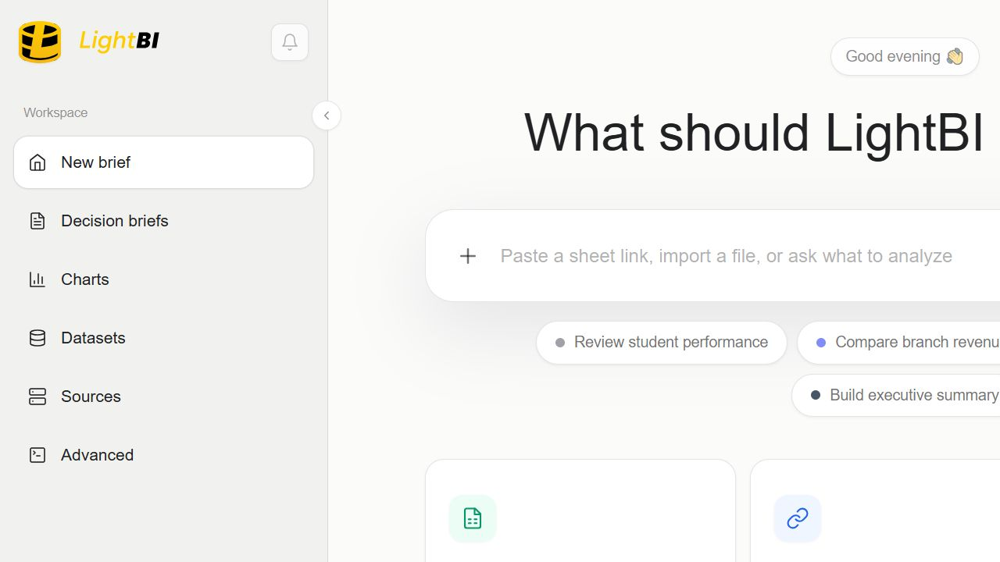
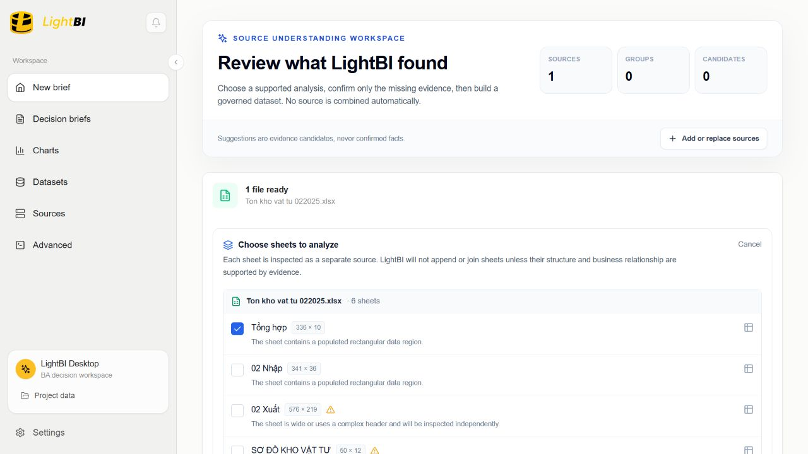
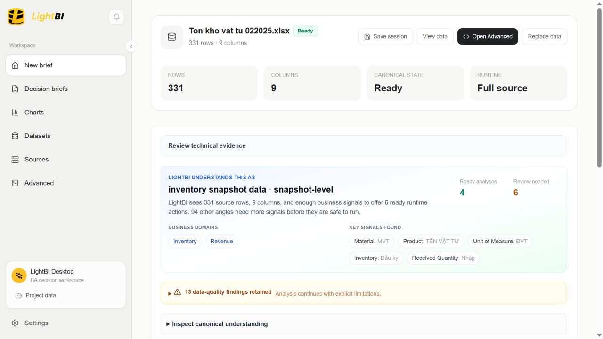
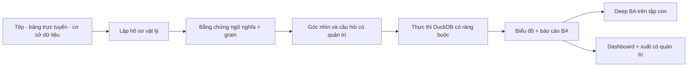

# LightBI

<p align="center">
  <strong>Phân tích kinh doanh có quản trị bằng chứng cho dữ liệu vận hành thực tế.</strong>
</p>

<p align="center">
  <a href="https://lightbi.thaiduy.digital">Demo trực tuyến</a> ·
  <a href="https://github.com/n8n2erpnext/lightbi/releases">Tải bản Beta</a> ·
  <a href="README.md">English</a>
</p>



LightBI biến bảng tính, tệp phân cách, bảng tính trực tuyến và cơ sở dữ liệu thành một quy trình phân tích kinh doanh có quản trị. Hệ thống lập hồ sơ nguồn vật lý, giải nghĩa nghiệp vụ bằng bằng chứng có thể truy vết, đề xuất câu hỏi an toàn, thực thi trên đúng nguồn đã ràng buộc và giữ giới hạn hiển thị xuyên suốt từ biểu đồ đến Dashboard.

LightBI được xây cho dữ liệu người dùng thực sự gặp: workbook nhiều sheet, tiêu đề không đồng nhất, dữ liệu đa ngôn ngữ, tệp xuất vận hành và các báo cáo ERP có liên quan nhưng không được phép ghép bằng phỏng đoán.

## Vì sao LightBI khác biệt

- **Hiểu dữ liệu trước khi vẽ biểu đồ.** Hồ sơ vật lý, ứng viên ngữ nghĩa, kiểm tra grain, mức sẵn sàng và provenance được xử lý trước khi một phân tích được đề xuất.
- **Thực thi có quản trị.** Câu hỏi, chỉ số, chiều phân tích, danh tính nguồn và tính liên tục runtime luôn được ràng buộc tới kết quả.
- **Deep BA đúng nghĩa.** Phát hiện được tổ chức theo khung: chuyện gì xảy ra, ở đâu, ai, khi nào, mức độ, bất thường, bước kiểm tra tiếp theo, hành động và điều còn chưa biết.
- **Đào sâu vào tập con.** Chọn một điểm trên biểu đồ, lọc các dòng bằng chứng rồi chạy cùng khung Deep BA trên phạm vi đã chọn.
- **Multi-source an toàn.** Các nguồn được giữ riêng cho tới khi quan hệ, vai trò, kỳ, danh tính và rủi ro nhân bản có đủ bằng chứng cho một tuyến phân tích được quản trị.
- **Desktop local-first.** Tệp cục bộ được phân tích bằng DuckDB nhúng, không bắt buộc tải dữ liệu lên một dịch vụ phân tích từ xa.
- **Từ bằng chứng tới đầu ra.** Tạo Dashboard, xuất Deep BA ra PNG/PDF, xuất drill rows ra CSV/Excel và chuẩn bị dữ liệu sạch cho các công cụ BI khác.

## Xem nhanh sản phẩm

### Workbook nhiều sheet luôn minh bạch

Mỗi sheet được kiểm tra độc lập. Người dùng có thể phân tích một sheet, chọn nhiều sheet hoặc xem toàn bộ workbook mà LightBI không âm thầm nối các bảng không tương thích.



### Cách LightBI hiểu dữ liệu luôn nhìn thấy được

LightBI hiển thị dạng dữ liệu suy luận, lĩnh vực nghiệp vụ được hỗ trợ, tín hiệu đã giải nghĩa, phân tích sẵn sàng, vấn đề chất lượng và giới hạn chưa giải quyết trước khi dùng cho quyết định.



## Quy trình cốt lõi



Biên nguồn canonical mang theo danh tính nguồn, fingerprint, thế hệ kiểm tra/lập hồ sơ, phạm vi dòng, bằng chứng ngữ nghĩa, bằng chứng grain và ràng buộc runtime. Metric preflight và execution sẽ fail-closed khi thiếu bằng chứng hoặc tính liên tục nguồn.

## Nguồn dữ liệu hỗ trợ

| Nguồn | Hỗ trợ trong Beta |
|---|---|
| Excel `.xlsx` / `.xls` | Kiểm tra nhiều sheet và lựa chọn sheet rõ ràng |
| CSV / TSV / text | Phân tích vật lý, lập hồ sơ và thực thi cục bộ |
| JSON | Kiểm tra dữ liệu có cấu trúc cục bộ |
| Google Sheets / tệp trực tuyến công khai | Online-first qua cùng biên canonical |
| PostgreSQL, MySQL, MariaDB, SQLite, MongoDB | Advanced workspace; Easy Mode chỉ nhận kết quả đầy đủ |
| Bộ tệp ERP liên quan | Phân tích vai trò/kỳ có quản trị; không ghép nguồn bằng suy đoán |

## Năng lực BA

- Doanh thu, hiệu suất bán hàng, số lượng, giá, chiết khấu, cơ cấu và khả năng sinh lời
- Tồn kho, luân chuyển, tuổi tồn, mức tập trung, rủi ro thiếu/dư tồn và mất cân đối nhập/xuất
- Khối lượng logistics, tuyến, hub, carrier, trạng thái, SLA, lead time, ngoại lệ và chi phí giao hàng
- Bằng chứng tài chính/kế toán: doanh thu, chi phí, lợi nhuận gộp, biên lợi nhuận, phải thu/phải trả và so sánh kỳ
- Phân khúc theo khách hàng, nhân viên, người phụ trách, chi nhánh, khu vực, sản phẩm, vật tư và kho
- Deep BA progressive disclosure với dòng bằng chứng, confidence, caveat, câu hỏi tiếp nối và action candidate
- Phân tích đơn nguồn, tập con đã lọc, nhiều kỳ và multi-source có quản trị

## Kiến trúc

LightBI là monorepo TypeScript + Rust:

```text
apps/desktop/          Giao diện React 19 cho desktop và web QA
apps/server/           Axum backend nhúng/độc lập và Advanced APIs
packages/              UI, runtime, schema và query contract dùng chung
crates/                Domain, runtime, DuckDB, export và Tauri bằng Rust
sample-corpus/         Corpus regression ngữ nghĩa đã được làm sạch
scripts/               Công cụ build native có thể tái lập
```

Đọc thêm: [Kiến trúc](docs/ARCHITECTURE.md), [Mô hình riêng tư](docs/PRIVACY.md), [Ghi chú Beta](docs/BETA.md).

## Chạy cục bộ

### Yêu cầu

- Node.js 22+
- pnpm 11.4+
- Rust stable (chỉ cần cho desktop native)

```bash
pnpm install --frozen-lockfile
pnpm --filter @lightbi/desktop dev
```

Mở `http://localhost:5173`.

### Kiểm tra

```bash
pnpm --filter @lightbi/desktop build
pnpm --filter @lightbi/desktop test
```

Một số acceptance suite mở rộng sử dụng fixture vận hành riêng tư và không được công bố. `sample-corpus` trong repo chứa fixture đã làm sạch cho các cổng regression ngữ nghĩa và quản trị công khai.

## Desktop Beta

Mỗi tag phát hành được GitHub Actions build trên Windows. Release bao gồm:

- bộ cài NSIS per-machine;
- checksum SHA-256;
- tag nguồn chính xác dùng để tạo artifact.

Tải bản mới nhất tại [GitHub Releases](https://github.com/n8n2erpnext/lightbi/releases).

## Giới hạn Beta

- LightBI tạo phát hiện phân tích có ràng buộc bằng chứng, không tự đưa ra quyết định kinh doanh.
- Ngôn ngữ nhân quả bị chặn khi dữ liệu chưa đủ bằng chứng.
- Dashboard và investigation session hiện được tối ưu cho một phiên desktop đang hoạt động.
- Database Easy Mode cần handoff đầy đủ có quản trị; kết quả bị giới hạn/phân trang không được dùng cho quyết định.
- Public Beta ưu tiên Windows. Bản web phục vụ đánh giá sản phẩm.

## Bảo mật và riêng tư

Đọc [SECURITY.md](SECURITY.md) trước khi báo cáo lỗ hổng. Biên local-first và mô hình xử lý thông tin xác thực được trình bày tại [docs/PRIVACY.md](docs/PRIVACY.md).

## Đóng góp

LightBI hoan nghênh các đóng góp nhỏ, có bằng chứng. Hãy bắt đầu với [CONTRIBUTING.md](CONTRIBUTING.md). Thay đổi mapping ngữ nghĩa, grain policy, metric authorization hoặc source continuity phải có kiểm thử cho cả trường hợp đúng và trường hợp đối nghịch không được phép khớp.

---

LightBI đang ở Public Beta: sản phẩm sẽ tiếp tục thay đổi nhanh, giữ giới hạn minh bạch và cải tiến dựa trên bằng chứng.
