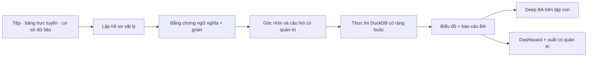

# LightBI

<p align="center">
  <strong>Phân tích kinh doanh có quản trị bằng chứng cho dữ liệu vận hành thực tế.</strong>
</p>

<p align="center">
  <a href="https://lightbi.thaiduy.digital/app">Demo trực tuyến</a> ·
  <a href="https://lightbi.thaiduy.digital/">Tải bản Beta</a> ·
  <a href="README.md">English</a>
</p>


LightBI biến bảng tính, tệp phân cách, bảng tính trực tuyến và cơ sở dữ liệu thành một quy trình phân tích kinh doanh có quản trị. Hệ thống lập hồ sơ nguồn vật lý, giải nghĩa nghiệp vụ bằng bằng chứng có thể truy vết, đề xuất câu hỏi an toàn, thực thi trên đúng nguồn đã ràng buộc và giữ giới hạn hiển thị xuyên suốt từ biểu đồ đến Dashboard.

LightBI được xây cho dữ liệu người dùng thực sự gặp: workbook nhiều sheet, tiêu đề không đồng nhất, dữ liệu đa ngôn ngữ, tệp xuất vận hành và các báo cáo ERP có liên quan nhưng không được phép ghép bằng phỏng đoán.

## Vì sao LightBI khác biệt

- **Hiểu dữ liệu trước khi vẽ biểu đồ.** Hồ sơ vật lý, ứng viên ngữ nghĩa, kiểm tra grain, mức sẵn sàng và provenance được xử lý trước khi một phân tích được đề xuất.
- **Thực thi có quản trị.** Câu hỏi, chỉ số, chiều phân tích, danh tính nguồn và tính liên tục runtime luôn được ràng buộc tới kết quả.
- **Deep BA đúng nghĩa.** Phát hiện được tổ chức theo khung: chuyện gì xảy ra, ở đâu, ai, khi nào, mức độ, bất thường, bước kiểm tra tiếp theo, hành động và điều còn chưa biết.
- **Đào sâu vào tập con.** Chọn một điểm trên biểu đồ, lọc các dòng bằng chứng rồi chạy cùng khung Deep BA trên phạm vi đã chọn.
- **Multi-source an toàn.** Các nguồn được giữ riêng cho tới khi quan hệ, vai trò, kỳ, danh tính và rủi ro nhân bản có đủ bằng chứng cho một tuyến phân tích được quản trị.
- **Desktop local-first.** Tệp cục bộ được phân tích bằng DuckDB nhúng, không bắt buộc tải dữ liệu lên một dịch vụ phân tích từ xa.
- **Từ bằng chứng tới đầu ra.** Tạo Dashboard, xuất Deep BA ra PNG/PDF, xuất drill rows ra CSV/Excel và chuẩn bị dữ liệu sạch cho các công cụ BI khác.

## Xem nhanh sản phẩm

### Một báo cáo ERP được hiểu thành bằng chứng kinh doanh

LightBI lập hồ sơ toàn bộ nguồn, giải nghĩa các khái niệm như doanh thu, sản phẩm, chi nhánh, nhân viên bán hàng, thanh toán và trạng thái; sau đó chỉ đề xuất các câu hỏi có thể thực thi an toàn trên đúng nguồn.


### Sáu báo cáo ERP liên quan trong một workspace multi-file có quản trị

Bộ sample công khai gồm báo cáo Sales, Accounting và Logistics của hai kỳ. LightBI nhận diện 6 nguồn, 3 vai trò nghiệp vụ, 9.000 dòng và 2 kỳ mà không san phẳng các dòng dữ liệu không liên quan vào một bảng.


Tổng quan điều hành có quản trị so sánh doanh thu, lợi nhuận gộp và hoạt động giao hàng theo kỳ, đồng thời giữ nguyên biên của từng nguồn.


### Deep BA bước 1: điều tra toàn bộ phạm vi phân tích

Deep BA được tổ chức như một cuộc điều tra, không phải chú thích biểu đồ sinh tự động: chuyện gì xảy ra, xảy ra ở đâu, yếu tố nào có thể liên quan, bất thường ở đâu, điều gì quan trọng nhất, cần kiểm tra gì tiếp, hành động khả dĩ và điều gì vẫn chưa biết. Mỗi phát hiện giữ dòng bằng chứng, độ tin cậy và giới hạn.


### Deep BA bước 2: tính lại trên tập con đã chọn

Chọn một điểm trên biểu đồ, xem hoặc lọc thêm các dòng phù hợp, sau đó chạy cùng khung BA trên tập con. KPI, phân rã, phát hiện và khuyến nghị được tính lại cho phạm vi đã chọn, không lặp lại kết quả của toàn file.


### Advanced Mode cho nhà phân tích cần kiểm soát trực tiếp

Advanced Mode cung cấp workspace có quản trị cho file, bảng tính trực tuyến, SQL Server, PostgreSQL, MySQL, MariaDB, SQLite và MongoDB; mặc định read-only, kèm safe mode, SSH tùy chọn, khám phá schema, lịch sử truy vấn, chỉnh sửa database theo transaction có bước duyệt và refresh toàn nguồn sau chỉnh sửa để quay lại Easy mà không cần export/import lại. Mini-IDE Monaco chạy nội bộ cung cấp từ khóa, hàm, mẫu SQL an toàn và phím tắt cho mọi gói; Pro mở thêm gợi ý theo dialect, schema, bảng và cột mà không truyền nội dung SQL hay định danh database ra ngoài. Hồ sơ kết nối được mã hóa cục bộ giúp không phải nhập lại thông tin mà không để lộ secret trong lịch sử hoặc phản hồi giao diện.

Phiên đã lưu giữ URL trực tuyến chuẩn hóa và bản sao nguồn local thuộc vùng dữ liệu của ứng dụng. Phiên cũ chỉ có mẫu sẽ yêu cầu liên kết lại nguồn một lần có kiểm tra, sau đó những lần mở tiếp theo dùng toàn bộ nguồn đã lưu.


## Quy trình cốt lõi



Biên nguồn canonical mang theo danh tính nguồn, fingerprint, thế hệ kiểm tra/lập hồ sơ, phạm vi dòng, bằng chứng ngữ nghĩa, bằng chứng grain và ràng buộc runtime. Metric preflight và execution sẽ fail-closed khi thiếu bằng chứng hoặc tính liên tục nguồn.

## Nguồn dữ liệu hỗ trợ

| Nguồn | Hỗ trợ trong Beta |
|---|---|
| Excel `.xlsx` / `.xls` | Kiểm tra nhiều sheet và lựa chọn sheet rõ ràng |
| CSV / TSV / text | Phân tích vật lý, lập hồ sơ và thực thi cục bộ |
| JSON | Kiểm tra dữ liệu có cấu trúc cục bộ |
| Google Sheets / tệp trực tuyến công khai | Online-first qua cùng biên canonical |
| SQL Server, PostgreSQL, MySQL, MariaDB, SQLite, MongoDB | Kiểm tra read-only và Advanced; SQL Server hỗ trợ snapshot Easy Mode đầy đủ chính xác |
| Bộ tệp ERP liên quan | Phân tích vai trò/kỳ có quản trị; không ghép nguồn bằng suy đoán |

## Năng lực BA

- Doanh thu, hiệu suất bán hàng, số lượng, giá, chiết khấu, cơ cấu và khả năng sinh lời
- Tồn kho, luân chuyển, tuổi tồn, mức tập trung, rủi ro thiếu/dư tồn và mất cân đối nhập/xuất
- Khối lượng logistics, tuyến, hub, carrier, trạng thái, SLA, lead time, ngoại lệ và chi phí giao hàng
- Bằng chứng tài chính/kế toán: doanh thu, chi phí, lợi nhuận gộp, biên lợi nhuận, phải thu/phải trả và so sánh kỳ
- Phân khúc theo khách hàng, nhân viên, người phụ trách, chi nhánh, khu vực, sản phẩm, vật tư và kho
- Deep BA progressive disclosure với dòng bằng chứng, confidence, caveat, câu hỏi tiếp nối và action candidate
- Phân tích đơn nguồn, tập con đã lọc, nhiều kỳ và multi-source có quản trị

## Kiến trúc

LightBI là monorepo TypeScript + Rust:

```text
apps/desktop/          Giao diện React 19 cho desktop và web QA
apps/server/           Axum backend nhúng/độc lập và Advanced APIs
packages/              UI, runtime, schema và query contract dùng chung
crates/                Domain, runtime, DuckDB, export và Tauri bằng Rust
sample-corpus/         Corpus regression ngữ nghĩa đã được làm sạch
scripts/               Công cụ build native có thể tái lập
```

Đọc thêm: [Kiến trúc](docs/ARCHITECTURE.md), [Mô hình riêng tư](docs/PRIVACY.md), [Ghi chú Beta](docs/BETA.md).

## Chạy cục bộ

### Yêu cầu

- Node.js 22+
- pnpm 11.4+
- Rust stable (chỉ cần cho desktop native)

```bash
pnpm install --frozen-lockfile
pnpm --filter @lightbi/desktop dev
```

Mở `http://localhost:5173/app` để dùng giao diện web. Portal tải ứng dụng/tài khoản chính thức được vận hành từ LightBI control plane riêng tư và không còn implementation trong repository Basic công khai này.

### Kiểm tra

```bash
pnpm --filter @lightbi/desktop build
pnpm --filter @lightbi/desktop test
```

Một số acceptance suite mở rộng sử dụng fixture vận hành riêng tư và không được công bố. `sample-corpus` trong repo chứa fixture đã làm sạch cho các cổng regression ngữ nghĩa và quản trị công khai.

## Desktop Beta

Mỗi tag phát hành được GitHub Actions build tách biệt trên runner Windows và Ubuntu; chỉ phát hành khi cả hai đạt. Release bao gồm:

- bộ cài Windows NSIS `.exe` có icon LightBI;
- gói Debian/Ubuntu x86_64 `.deb`;
- checksum SHA-256;
- một release manifest đa nền tảng được mirror vào namespace R2 bất biến của LightBI;
- tag nguồn chính xác dùng để tạo artifact.

Tải từ [LightBI Distribution Portal](https://lightbi.thaiduy.digital/) hoặc trực tiếp tại [GitHub Releases](https://github.com/n8n2erpnext/lightbi/releases). Portal nhận diện Windows/Linux để đề xuất đúng artifact từ manifest nhưng luôn giữ mục Other Downloads.

## Giới hạn Beta

- LightBI tạo phát hiện phân tích có ràng buộc bằng chứng, không tự đưa ra quyết định kinh doanh.
- Ngôn ngữ nhân quả bị chặn khi dữ liệu chưa đủ bằng chứng.
- Dashboard và investigation session hiện được tối ưu cho một phiên desktop đang hoạt động.
- Database Easy Mode cần handoff đầy đủ có quản trị; kết quả bị giới hạn/phân trang không được dùng cho quyết định.
- Windows là native target chính; Debian/Ubuntu là target public test có build/kiểm chứng riêng. Bản web tiếp tục phục vụ đánh giá sản phẩm.

## Bảo mật và riêng tư

Đọc [SECURITY.md](SECURITY.md) trước khi báo cáo lỗ hổng. Biên local-first và mô hình xử lý thông tin xác thực được trình bày tại [docs/PRIVACY.md](docs/PRIVACY.md).

Bản native Beta có thể gửi installation ID ẩn danh, thời lượng phiên và mã tính năng thuộc whitelist như Easy Mode, Advanced Mode, Deep BA hoặc sự kiện chỉnh sửa database có quản trị; người dùng có thể tắt pairing. LightBI không gửi file đã nhập, nội dung SQL, URL database, tên schema/bảng/cột, giá trị ô, biểu đồ hoặc phát hiện BA. Tài khoản Google hoặc email/mật khẩu đã xác minh là điểm neo entitlement/device. Admin phân phối có thể cấp, gửi mail, rotate hoặc thu hồi Pro key dạng hash; key lưu trữ/hiển thị quản trị chỉ lộ prefix và suffix đã che phần giữa.

## Đóng góp

LightBI hoan nghênh các đóng góp nhỏ, có bằng chứng. Hãy bắt đầu với [CONTRIBUTING.md](CONTRIBUTING.md). Thay đổi mapping ngữ nghĩa, grain policy, metric authorization hoặc source continuity phải có kiểm thử cho cả trường hợp đúng và trường hợp đối nghịch không được phép khớp.

---

LightBI đang ở Public Beta: sản phẩm sẽ tiếp tục thay đổi nhanh, giữ giới hạn minh bạch và cải tiến dựa trên bằng chứng.
