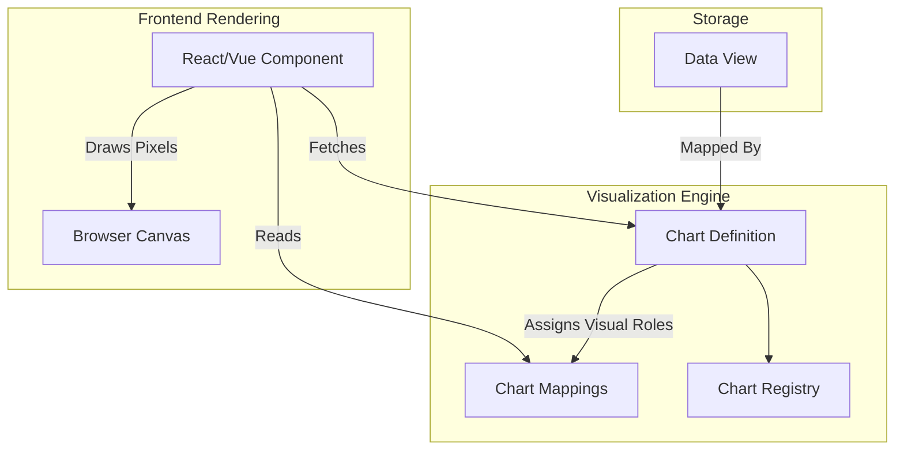

# Chart Architecture Model

In LightBI, a `Chart` is a declarative configuration blueprint. It is entirely decoupled from data execution and from physical pixel rendering.

## Architectural Flow

## Why decouple Charts from rendering?
If a Chart contains React code, the backend cannot validate it, and we cannot easily port LightBI to a mobile native app or a desktop Rust app (Tauri). By treating a Chart as a pure JSON blueprint (`ChartDefinition`), the frontend simply acts as an interpreter. This is how we guarantee a crash-free UI.
