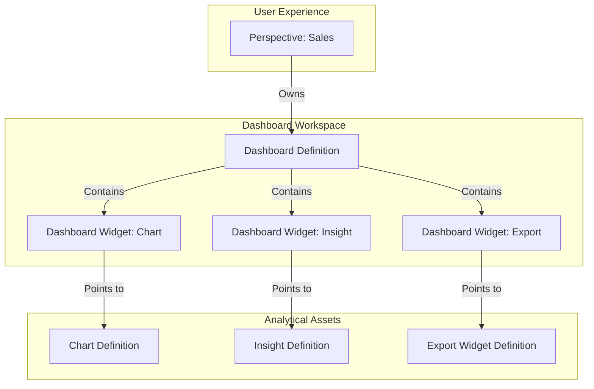

# Dashboard Architecture Model

In LightBI, a Dashboard is not a "screen of queries." It is a structural workspace that aggregates pointers to existing analytical assets.

## Architectural Flow

## Why decouple Dashboards from Assets?
In many traditional BI tools, creating a chart *inside* a dashboard locks that chart to that dashboard. By forcing Dashboards to only contain pointers (`asset_id`), we allow the exact same Revenue Chart to be placed on the Executive Dashboard, the Sales Dashboard, and the Marketing Dashboard simultaneously. If the Revenue Chart's definition is updated, all three dashboards instantly reflect the change.
