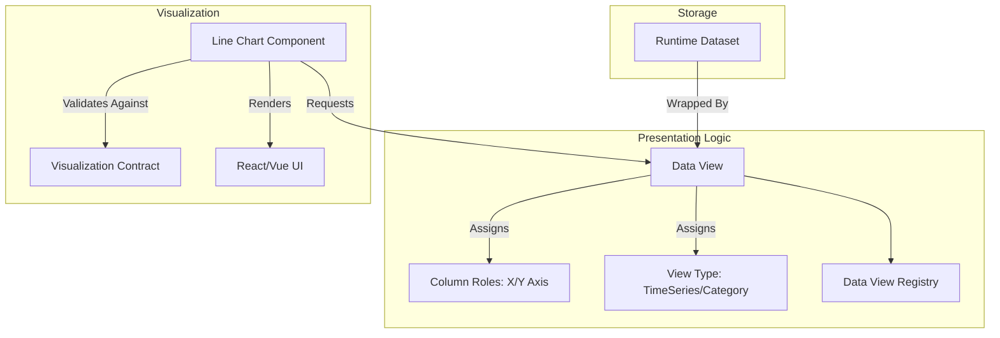

# Data View Architecture

The `DataView` is an abstraction layer sitting directly on top of `RuntimeDatasets`. It is the final layer before UI rendering occurs.

## Architectural Flow

## The Role of the Data View
A Runtime Dataset might have 50 columns. A UI Line Chart component cannot possibly know which of those 50 columns should be the X-Axis and which should be the Y-Axis. 

The `DataView` maps explicit roles (`DataViewField`) to columns. This allows the Chart Component to be incredibly "dumb". The Chart simply asks the Data View for the "X-Axis" array and renders it.
