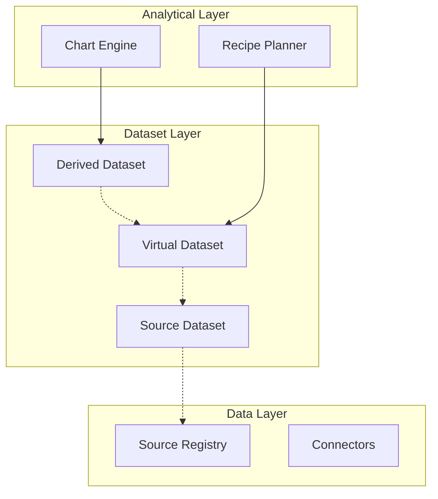

# Dataset Model Architecture

The Dataset Model establishes the fundamental barrier between raw data sources and actionable analytics execution.

## The Bridging Role

## Dataset Lineage

Because datasets are highly composable (e.g. Virtual Datasets wrapping multiple other datasets and sources), LightBI explicitly tracks lineage via the `DatasetLineage` schema.

This lineage enables:
1. **Intelligent Refreshing**: If Source A updates, the Planner traverses the lineage tree to invalidate only the derived datasets that rely on Source A.
2. **Audit Trails**: Providing perfect transparency on how a specific Chart's dataset was constructed.
3. **AI Context**: Allowing the AI to trace a dataset back to its roots to understand the semantics better before generating insights.
