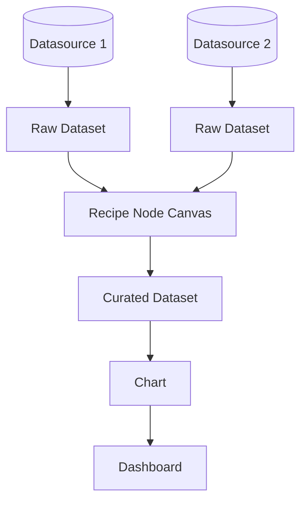

# LightBI Dataset Recipe Model

This document outlines the canonical execution architecture that drives all dataset transformations. 

## Data Flow

## Recipe Execution Boundary
`packages/query-models` is strictly a schema definition layer.
* Contains **schemas only**.
* **No** execution logic.
* **No** DuckDB integration or generation.
* **No** connector calls.
* **No** AI calls.
* **No** validation engine yet.

## AI Compatibility

AI never produces datasets directly. AI produces recipes.
1. The AI reads schema context and user prompts.
2. The AI outputs a structured Dataset Recipe.
3. The User reviews and approves the recipe.
4. The Rust Core executes the recipe.

## Multi-Source Compatibility

A recipe can accept multiple independent Raw Datasets as input, enabling powerful cross-platform analysis without a centralized ETL warehouse.

Examples of Recipe Inputs:
* `CSV + CSV`
* `CSV + Excel`
* `ERPNext + Excel`
* `Postgres + Google Sheet`

The recipe defines how these independent sources are joined and processed to form the final Curated Dataset.
