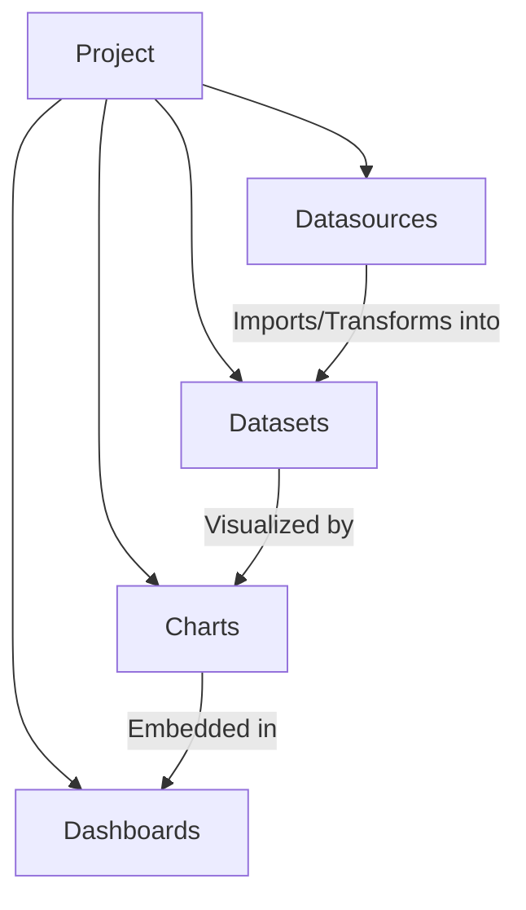

# LightBI Domain Model

This document outlines the core domain model for LightBI. The application follows a dataset-centric architecture designed to be intuitive for non-technical users and to align with common business reporting workflows.

## Core Hierarchy

The primary domain objects follow a strict hierarchical structure, where every asset belongs to a root `Project`.

## 1. Project Model
The `Project` is the root container for all assets. Nothing exists outside a project.
- **Role:** Owns connections, transformed data, visualizations, and layouts.
- **Isolation:** Ensures data from one project cannot bleed into another.

## 2. Datasource Model
A `Datasource` represents a connection to an external data origin.
- **Role:** Stores connection metadata, credentials (handled securely by Rust), and configuration.
- **Supported Types:** CSV, Excel, JSON, SQLite, PostgreSQL, MySQL, MariaDB, MongoDB, ERPNext.
- **Note:** The Datasource model does NOT store actual records, only connection logic and metadata.

## 3. Dataset Model
The `Dataset` is the central operational object in LightBI.
- **Role:** Represents structured, queryable data. This is what users interact with to build charts.
- **Origins:** A dataset can originate from a file import, a database table, a query transformation, or an ERPNext resource.
- **Structure:** Exposes columns, schema definitions, and metadata.
- **Philosophy:** Queries are considered implementation details of a dataset. Users think in "Datasets" rather than "SQL".

## 4. Chart Model
A `Chart` visualizes data from a specific `Dataset`.
- **Role:** Stores visualization type, axis mappings, and formatting options.
- **Relationships:** A chart strictly references a single dataset.
- **Supported Types:** Line, Bar, Number, Pie, Donut, Table, Funnel, Bubble (with more planned).

## 5. Dashboard Model
A `Dashboard` is a collection of widgets laid out on a grid.
- **Role:** Serves as the high-level presentation layer for stakeholders.
- **Relationships:** Dashboards reference multiple `Chart` objects (or other widget types like text/KPI).
- **Structure:** Stores layout coordinates, widget configurations, and dashboard-level filters.
