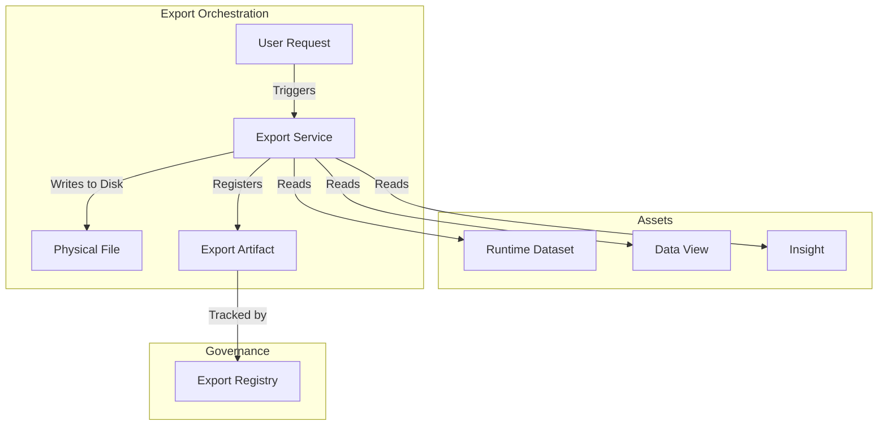

# Export Architecture Model

In LightBI, generating a file (like a CSV or PDF) is not a casual frontend action. It is a governed orchestration managed by the `ExportService`.

## Architectural Flow

## Why Centralize Exports?
If a user clicks "Download CSV" on a chart, and the chart generates the CSV directly, the application has no record of that action. By forcing all exports through the `ExportService`, we guarantee that every file leaving the system is recorded, versioned, and perfectly traceable back to its source data.
