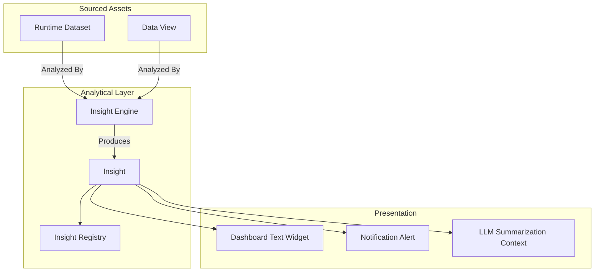

# Insight Architecture Model

In LightBI, an `Insight` is an analytical asset that sits alongside a `DataView`. While a DataView dictates how to draw a chart, an Insight dictates how to explain the data.

## Architectural Flow

## Why decoupled from charts?
Insights do not care how they are rendered. A `Trend Insight` that identifies a 15% drop in revenue can be displayed as a red arrow next to a KPI, a text paragraph in a weekly email, or fed into an LLM context window to answer user questions. By making Insights first-class assets, they become universally reusable.
