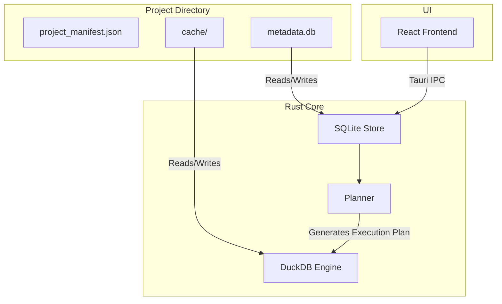

# Persistence Model Architecture

LightBI separates state metadata from analytical data explicitly at the storage layer.

## Architecture Flow

## Boundaries

1. **Project Folder**: The root directory containing all necessary files for a single LightBI project. Includes the `project_manifest.json` which tracks the identity and schema versions.
2. **SQLite Metadata**: The absolute source of truth for the structure of the UI and the domain models, accessed via a unified `ProjectStore` rather than fragmented CRUD repositories.
3. **Runtime**: The execution engine (DuckDB) which does not know anything about "Dashboards" or "UI". It only receives analytical queries from the Planner.
4. **Planner**: Bridges the gap by reading the structural Recipe from SQLite, planning it, and handing the analytical execution graph to DuckDB.
