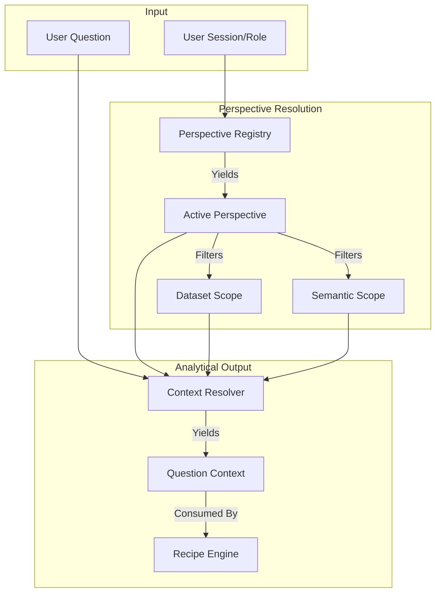

# Perspective Model Architecture

The Perspective Layer dictates how data is interpreted before any analytical generation occurs. The same dataset implies vastly different things depending on the user's role.

## Architectural Flow

## Core Enforcement
- **No Direct Querying**: The application strictly prohibits jumping straight from a `Question` to a `Recipe`.
- **Role Scoping**: A `Branch Manager` Perspective inherits the core `Sales` logic but aggressively filters the `Dataset Scope` down to their specific branch.
