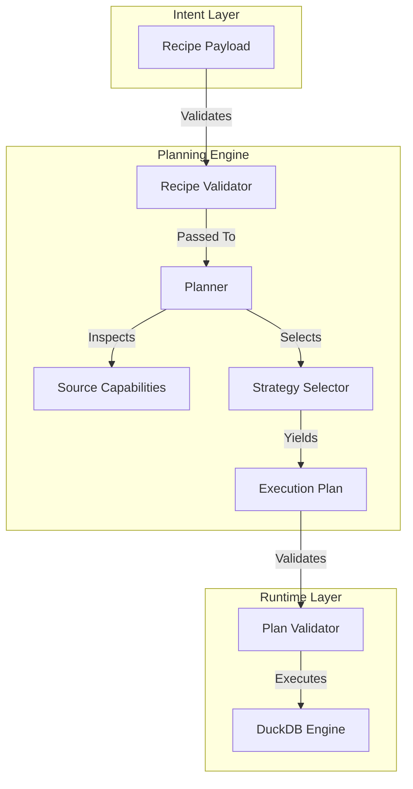

# Planner Model Architecture

The Planner is the strategic brain of LightBI. It sits precisely between the abstract user intent (Recipes) and the mechanical reality of the database engine (Runtime).

## Architectural Flow

## Why Planning Exists
If a user requests the total sum of sales, and the backend is a 10TB Postgres database, downloading all 10TB to DuckDB to perform a local sum is disastrous. The Planner intercepts this, checks if the Postgres connector `supports_sql_execution`, and emits a Pushdown Execution Plan instead, shifting the compute to Postgres and returning only 1 row to DuckDB.
