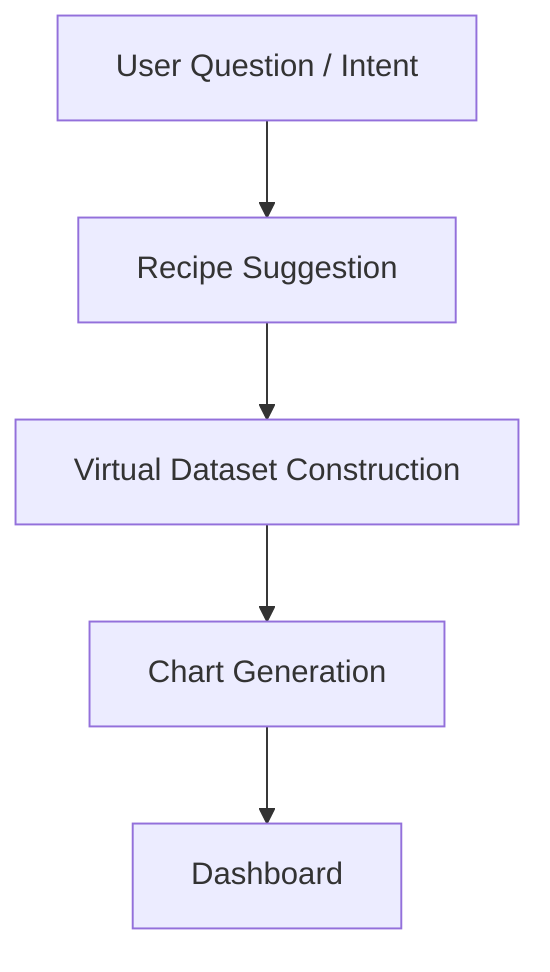

# LightBI Question-First UX Model

Traditional BI requires users to build raw assets first. LightBI reverses this paradigm to make analytics accessible to business operators without technical knowledge.

## The Question-First Pipeline

## Examples of Intent Mapping

Instead of asking the user to manually build a `SELECT ... GROUP BY` statement, the system provides intent-driven templates based on the user's domain context:

* **Compare two months**: Suggests a time-series filtering recipe combined with a variance column.
* **Compare actual vs target**: Suggests joining budget files with live sales records and generating a Bullet Chart or dual-axis bar chart.
* **Analyze logs**: Suggests a recipe prioritizing text parsing, timestamps, and row counts.
* **Analyze inventory**: Suggests grouping by product categories, identifying low stock, and highlighting turnover rates.
* **Analyze survey results**: Suggests pivoting answers into columns and generating sentiment aggregation.

## Future AI Compatibility

**Without AI**:
Users select pre-defined question templates and answer setup wizards (e.g., "Which column is Revenue?").

**With AI**:
AI infers question intent via natural language input ("Why did sales drop in Q3?"). 

**Critical Rule**:
* AI does **not** execute.
* AI only **suggests** the question mapping and recipes.
* User must **approve**.
* Rust Core exclusively **executes**.
