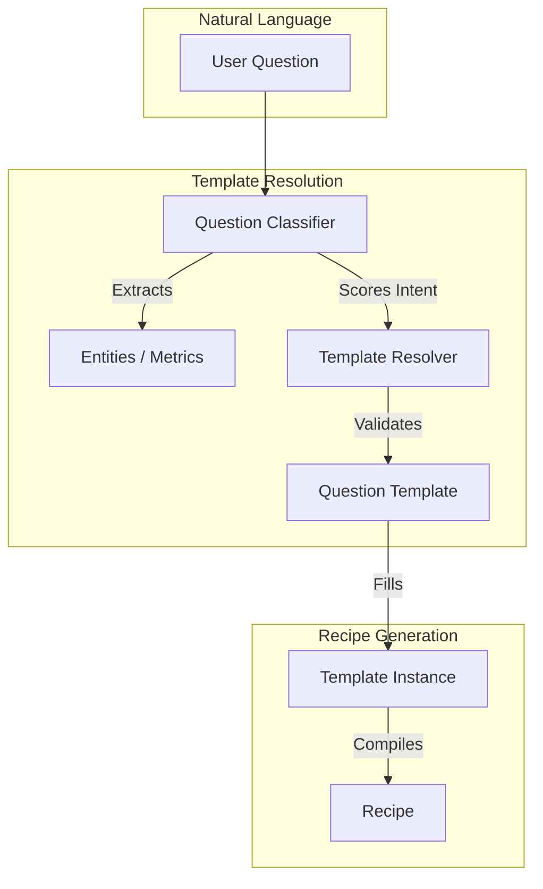

# Question Template Architecture

In LightBI, a Question Template is the secure bridge between natural language and deterministic execution. It prevents wild LLM hallucinations by forcing all questions to resolve into pre-approved, parameterized structures.

## Architectural Flow

## Anti-Hallucination Guardrails
Because the system never allows an LLM to generate SQL or Recipes directly, the AI's only job is to perform named-entity recognition and intent classification on the user's string, drastically simplifying the prompt and reducing error rates to near zero.
