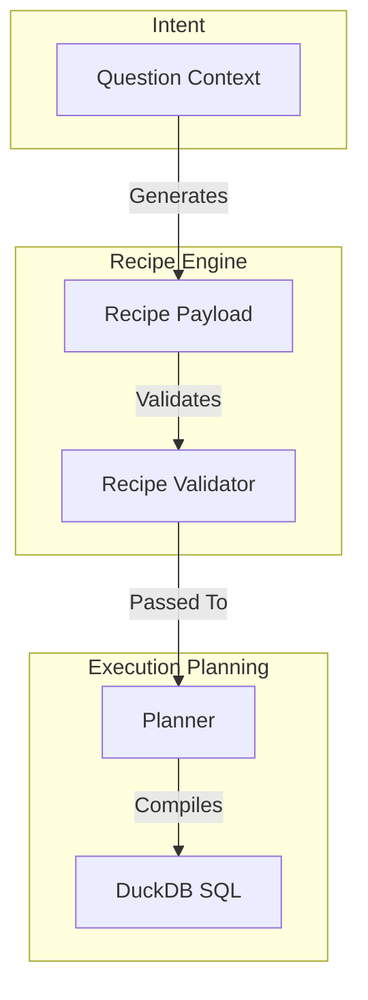

# Recipe Model Architecture

In LightBI, a Recipe is the canonical, backend-agnostic representation of analytical operations.

## Architectural Flow

## Core Tenets
1. **No Execution Logic:** A recipe cannot dictate "How" data is retrieved. It can never contain raw SQL strings or DuckDB-specific functions.
2. **Portability:** Because recipes strictly define "What" the user wants (via Intents), the executing backend could be swapped from DuckDB to Spark without changing a single Recipe.
3. **Traceability:** Recipes map perfectly to the UI's Visual Data Canvas, making it trivial to render the analytical steps to a user.
