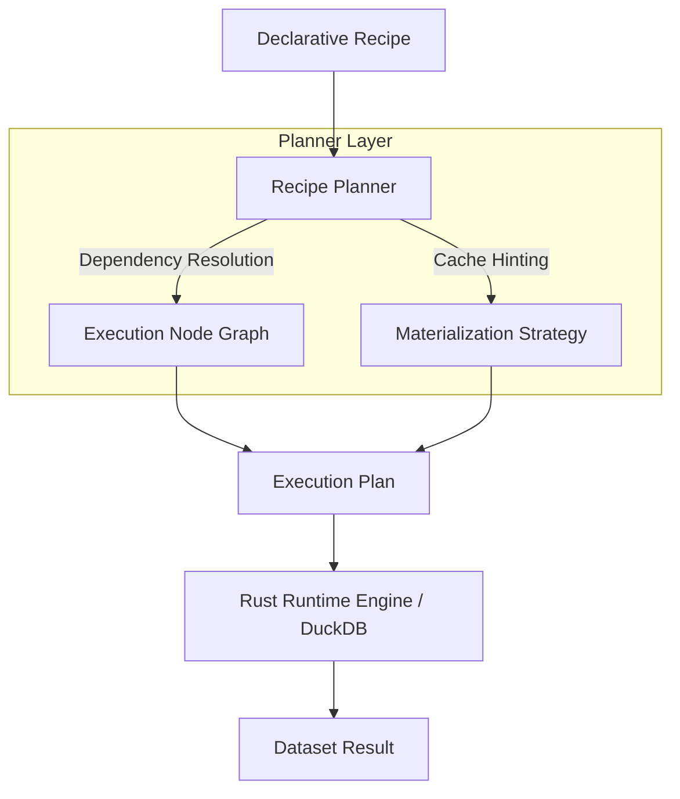

# Recipe Planner Model

To bridge the gap between a declarative `Recipe` and physical data processing, LightBI introduces the Recipe Planner. 

## Execution Flow

## Planner Responsibilities

* **Dependency Graph Creation**: Translating declarative operations into an execution DAG.
* **Refresh Invalidation**: Deciding if the dataset is stale based on its `RefreshStrategy`.
* **Source Change Propagation**: Invalidating downstream nodes when an upstream source (e.g. CSV) changes.
* **Execution Ordering**: Ensuring sources are loaded into memory before joining.
* **Cache Hinting**: Deciding if the output should be `virtual`, `cached`, `materialized`, or `temporary`.

## Runtime Boundary Strictness

**Planner ≠ Executor**

The Planner's only job is to create `ExecutionPlans`. It does absolutely zero data manipulation.
The **Rust Runtime** (containing DuckDB) receives the `ExecutionPlan` and does the heavy lifting to execute it.
