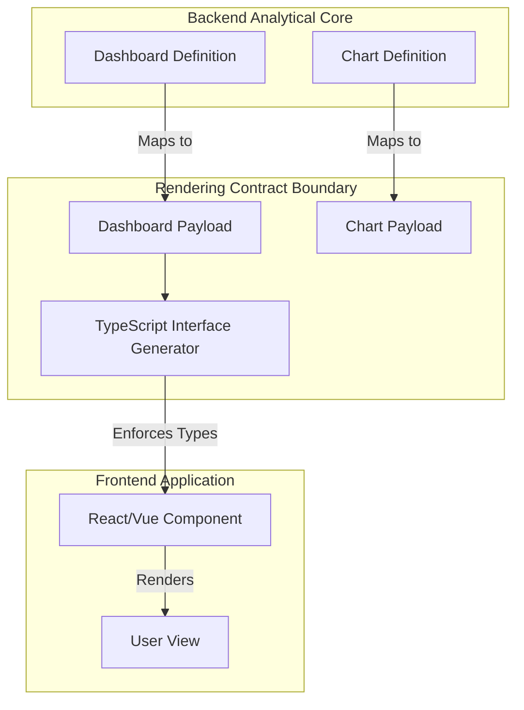

# Rendering Contract Architecture Model

The Rendering Contract establishes the absolute boundary between the Rust backend (analytical core) and the TypeScript frontend (presentation layer).

## Architectural Flow

## Why a Contract?
If a React component directly reads the raw `ChartDefinition` from the database, the frontend and backend become tightly coupled. A change to the backend planner might inadvertently break the UI. By creating explicit UI-Safe `Payloads` and generating TypeScript types from them, the frontend is perfectly protected from backend refactoring.
