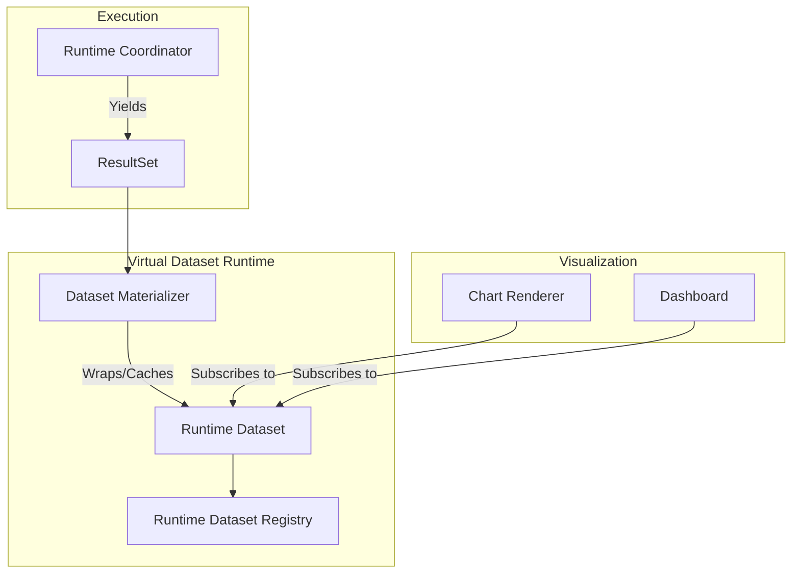

# Runtime Virtual Dataset Model

The `RuntimeDataset` serves as the reusable analytical asset generated by a successful query execution. It prevents UI components (like Charts) from interacting with raw execution artifacts.

## Architectural Flow

## Why Wrap ResultSets?
A `ResultSet` is just rows and columns. It has no memory of where it came from. A `RuntimeDataset` contains the `source_execution_id` (allowing it to be refreshed) and the `dataset_id` (linking it back to semantic meaning). By wrapping the result, we allow a single query execution to safely power 5 different charts on a dashboard without re-querying the database 5 times.
