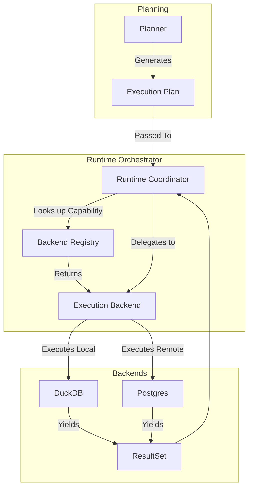

# Runtime Model Architecture

The Runtime Layer is the ultimate entry point for mechanical execution. It accepts optimized `ExecutionPlans` from the Planner and returns deterministic `ResultSets`.

## Architectural Flow

## Absolute Boundary
The `RuntimeCoordinator` is completely blind to UI rendering, Dashboards, and AI logic. It only cares about taking a sequence of deterministic steps and handing back a strongly typed table of data.
