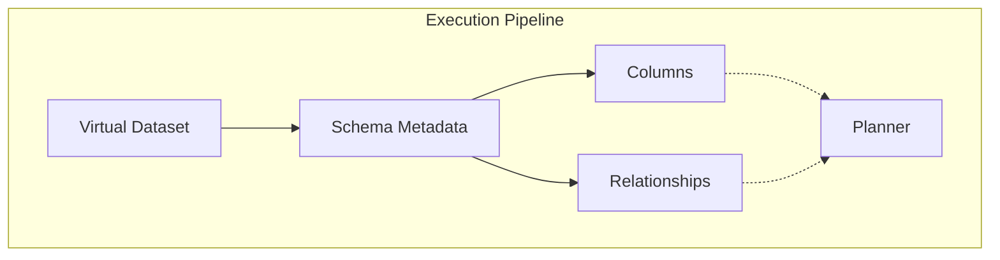

# Schema Model Architecture

The Schema Model dictates the precise structure of Datasets. It acts as the final buffer ensuring execution engines do not need to guess column types or table relationships when operating.

## Architectural Flow

## Discovery
1. The **Source Connector** interrogates the external system.
2. The connector surfaces `columns` and `relationships`.
3. The **Schema Layer** attaches this information to the `Dataset`.
4. The **Planner** reads from the Schema Layer, ignoring the Source entirely.
