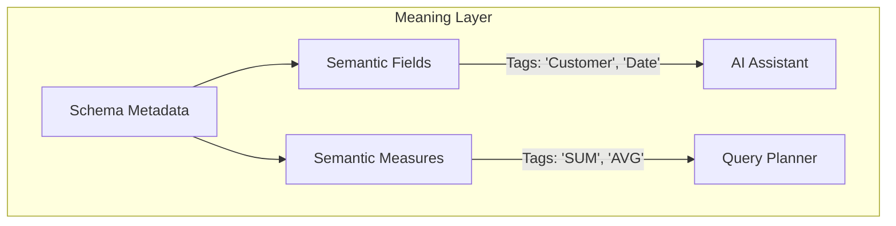

# Semantic Model Architecture

While the Schema Model handles literal structure (`VARCHAR`, `INT`), the Semantic Model classifies business meaning (`Customer`, `Revenue`).

## Architectural Flow

## Enforcement
- Future execution engines will never infer business meaning directly from raw source column names (e.g., guessing `cust_nm` means Customer).
- The Semantic Registry explicitly provides this overlay, enabling Natural Language querying in Phase 6 (Question First Analytics).
