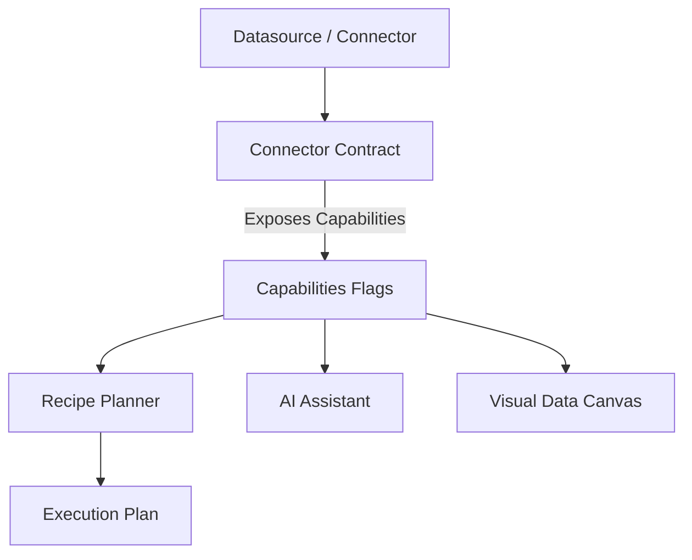

# Source Capability Model Architecture

The Source Capability Model allows the Recipe Planner to safely generate Execution Plans without hardcoding specific database behaviors. 

## Capability Resolution Flow

## Initial Capability Profiles

Different connectors inherently provide different abilities. The planner relies on these profiles:

* **CSV**: Supports file watch, preview, sampling. No pushdown aggregations.
* **Excel**: Similar to CSV, but handles multiple sheets as schemas.
* **Google Sheet**: Supports live polling, schema discovery, sampling. No deep pushdown.
* **Postgres**: Extremely capable. Supports pushdown filtering, pushdown aggregation, materialization hints, live streaming (logical replication), schema discovery.
* **MySQL**: Supports pushdown filtering/aggregation, schema discovery.
* **MongoDB**: Supports pushdown filtering, limited aggregation pushdown, schema discovery.
* **ERPNext**: Supports incremental sync, REST pushdown filtering, schema discovery.
* **REST APIs**: Usually only supports live fetching and very limited pushdown.
* **JSON**: File watch, schema discovery (inferred), no pushdown.
* **Log Files**: Incremental sync (tailing), fast file watching. No pushdown.

## AI and Planner Integration

**Planner Rule**: The Planner must *never* assume datasource features. If the capability flag `supportsPushdownAggregation` is false, the Planner must pull the raw data into the DuckDB runtime and execute the aggregation locally.

**AI Rule**: The AI Assistant can inspect these capabilities to recommend valid UI pathways. However, the AI cannot override capabilities. The connector's declared flags remain the absolute, authoritative truth.
