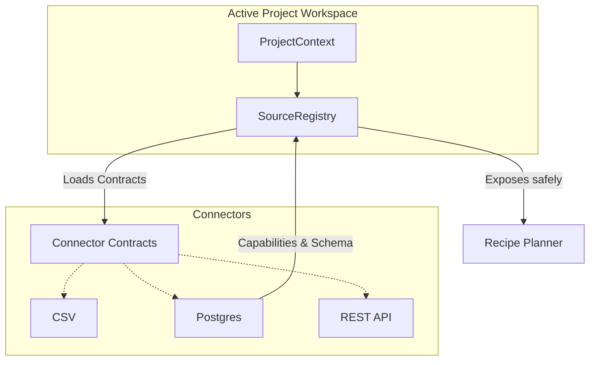

# Source Registry Architecture

The Source Registry enforces a strict boundary between LightBI's core runtime engine and external data systems. The runtime relies entirely on the capabilities exposed by standard connector contracts.

## Execution Flow

## Architectural Enforcement

1. **No direct dependencies**: The `Runtime` completely ignores whether it is querying CSV or Postgres. It strictly queries the abstract `ConnectorContract`.
2. **Capability-driven Planning**: The Planner looks at `capabilities.supports_pushdown_filtering` instead of doing `if source == 'postgres'`.
3. **No global sources**: A `SourceRegistry` is bound uniquely to an active `ProjectContext`. A source instantiated in "Project A" does not bleed its memory or connection pool into "Project B".
