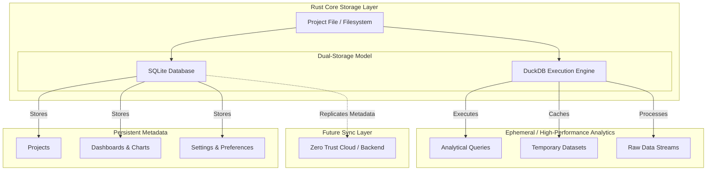

# LightBI Storage Architecture Model

LightBI implements a dual-storage paradigm within its Rust Core to cleanly separate configuration data from analytical execution.

## Storage Hierarchy

## Storage Responsibilities

1. **Project File**: The overarching wrapper or filesystem directory that groups the local database files together.
2. **SQLite Metadata**: Acts as the permanent source of truth for the structure of the application. If a user creates a new chart or changes a dashboard layout, it is saved here instantly. SQLite is highly concurrent for small metadata transactions.
3. **DuckDB Runtime**: Used strictly as an analytical accelerator. DuckDB ingests raw files (CSV, Excel) and remote data (Postgres, ERPNext) to perform blazing-fast OLAP queries in memory or on disk. It is ephemeral and highly performant.
4. **Future Sync Layer**: Because metadata is isolated in SQLite, future implementations of cloud sync or multi-device collaboration can easily replicate the SQLite file without needing to transfer heavy analytical datasets.
